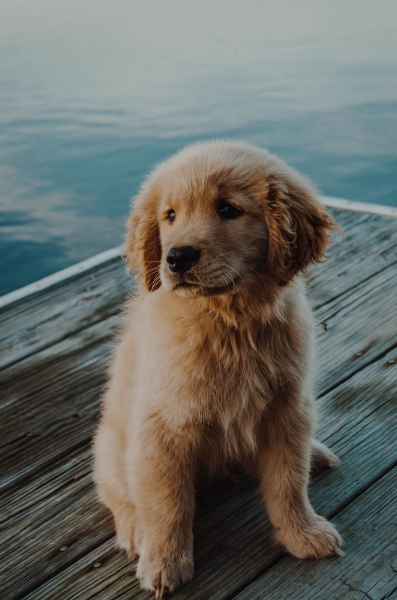
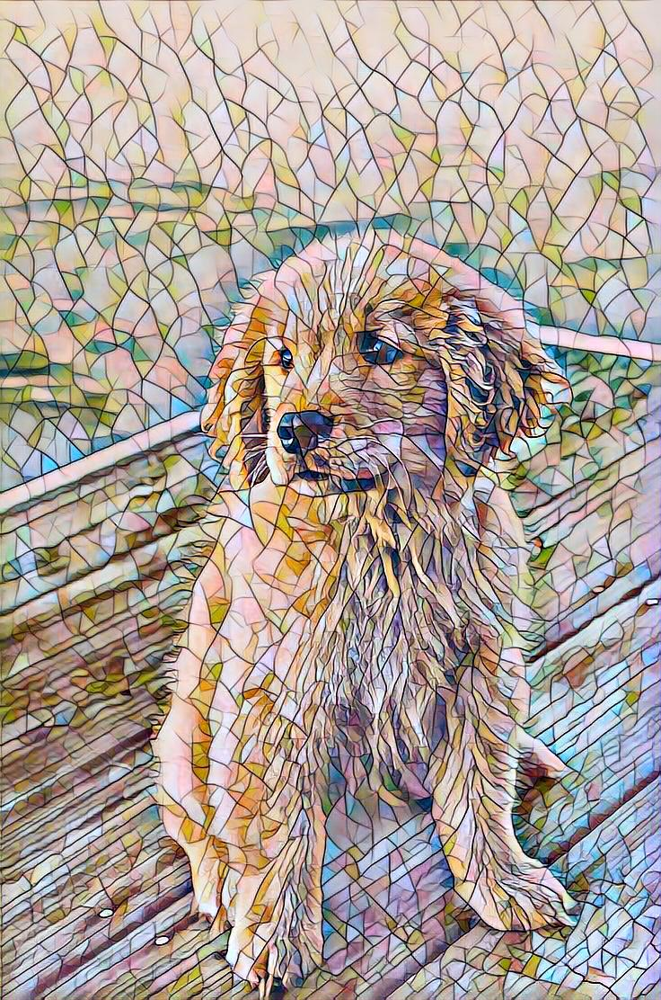

# Ghibli-Style Image Transfer – SoC EndTerm Submission (Weeks 1–End)

This repository showcases my complete progress in the Summer of Code (SoC) mentorship program, where I explored and implemented neural style transfer techniques, ultimately creating a real-time Ghibli-style image transfer model using **Fast Neural Style Transfer (FNST)**.

---

## Weekly Progress

---

### Week 1: Machine Learning Basics & Pandas

**Resources Used**  
- Andrew Ng’s Machine Learning YouTube Course  
- Kaggle Intro to Machine Learning Course  
- Pandas Tutorials  
- Optional Labs GitHub Repo

**What I Did**  
- Completed Kaggle's Intro to ML course  
- Practiced Pandas for data preprocessing  
- Learned core ML concepts:  
  - Train-test split  
  - Overfitting vs. underfitting  
  - Decision Trees and Random Forests  

**Assignment**  
- Participated in Kaggle House Price Prediction Competition  
- Submitted a basic model using `DecisionTreeRegressor`

**Improvements**  
- Understood the ML workflow  
- Learned to write modular and clean ML code

---

### Week 2: Neural Networks & PyTorch Basics

**Resources Used**  
- Aman Chadha’s Deep Learning GitHub  
- PyTorch documentation  

**What I Did**  
- Reviewed NN theory: forward & backward propagation  
- Learned about loss functions and optimizers  
- Practiced PyTorch essentials: tensors, `nn.Module`, loss & optimizer setup  

**Checkpoint Assignment**  
- **FashionVision Challenge**  
- Built a CNN classifier for Fashion-MNIST (10-class image dataset)  
- Used a LeNet-style architecture with `nn.Sequential`  
  - 2 Convolution layers  
  - 2 AvgPool layers  
  - 1 Fully connected layer  
- Trained with Adam optimizer & CrossEntropyLoss  
- Achieved **89.40% validation accuracy**  
- Created `submission.csv` with predictions  

**Improvements**  
- Learned how to build and train CNNs in PyTorch  
- Understood data preprocessing using `torch.utils.data.Dataset`  
- Got comfortable with training loops

---

### Week 3: Deep Learning & CNNs

**Resources Used**  
- CNN + Style Transfer Playlist (YouTube)  
- CIFAR-10 PyTorch Tutorial  
- CIFAR-10 Explained Video

**What I Did**  
- Trained a CNN classifier on CIFAR-10  
- Implemented data augmentation  
- Learned about CNN layers: `Conv2D`, `MaxPool`, `Flatten`, FC  
- Used GPU acceleration for faster training  

**Improvements**  
- Gained confidence in tuning CNNs  
- Learned to visualize training/validation loss & accuracy

---

### Week 4: Neural Style Transfer (Vanilla)

**Resources Used**  
- PyTorch Style Transfer Tutorial  
- Medium Blog on Style Transfer

**What I Did**  
- Implemented **Vanilla Style Transfer** using VGG-19 features  
- Understood the concept of **content vs style loss**  
- Tuned hyperparameters (style/content weights, learning rate, etc.)

**Improvements**  
- Learned to extract features using pretrained VGG  
- Understood how to balance multi-objective losses  
- Saw how optimization happens over an image rather than model weights

---

## Week 5: Real-Time Fast Neural Style Transfer (Theory Deep Dive)

**Resources Used**  
- [Real-Time Style Transfer – Johnson et al. (YouTube)](http://youtube.com/watch?v=VQEMptfWpLk)  
- [Fast Style Transfer Explained (YouTube)](https://www.youtube.com/watch?v=PO4D_JzwBos)  
- [Medium Blog – Towards Fast Neural Style Transfer](https://medium.com/data-science/towards-fast-neural-style-transfer-191012b86284)

**What I Learned**  
- Problems with vanilla transfer: slow optimization  
- Introduction to **transform networks** for fast, feedforward stylization  
- Training based on perceptual loss using VGG features  
- Architecture of Fast Style Transfer:  
  - Encoder-decoder network  
  - Residual blocks  
  - Batch training for style generalization

---

## Final Project: Ghibli-Style Image Transfer using Fast Neural Style Transfer (FNST)

**Base Implementation**  
- [GitHub Repo Reference](https://github.com/rosieyzh/MAIS202-Style-Transfer)  
- **Paper**: [Perceptual Losses for Real-Time Style Transfer – Johnson et al. (2016)](https://arxiv.org/pdf/1603.08155)  
- Compared with: [Original Style Transfer – Gatys et al. (2015)](https://arxiv.org/pdf/1508.06576)

### Core Pipeline

**Training Phase**  
- Input: MS-COCO images + single Ghibli-style image  
- Loss:
  - Content loss from VGG intermediate layers  
  - Style loss from Gram matrices  
  - Total variation loss for image smoothness  
- Model: Lightweight CNN (Transformer Network)  
- Output: Stylized image matching the Ghibli tone

**Inference Phase**  
- Trained model applies Ghibli style to **any image in real-time**  
- Feedforward-only (no backprop during inference)

---

### Code Structure

- `transformer_net.py` – CNN architecture for style transfer  
- `vgg_loss.py` – VGG-based perceptual loss module  
- `train.py` – Style transfer training script  
- `stylize.py` – Applies trained model to new images  
- `utils.py` – Data preprocessing utilities  

---

### Sample Results

| Content Image | Stylized Output (Ghibli) |
|---------------|--------------------------|
|  |  |

> *(replace with your actual result images)*

---

## Concepts Learned

- ML workflow (Week 1)  
- Feedforward NN and PyTorch basics (Week 2)  
- CNNs and image classification (Week 3)  
- Style Transfer – both **Vanilla** and **Fast** (Weeks 4–5)  
- Multi-objective loss tuning  
- Using pretrained models as feature extractors  
- Real-time deployment with trained transform networks

---

## Summary

| Week | Topic | Major Output |
|------|-------|--------------|
| 1 | ML + Pandas | House price prediction |
| 2 | Feedforward NN | Fashion-MNIST CNN |
| 3 | CNNs | CIFAR-10 classifier |
| 4 | Style Transfer | Vanilla NST using VGG-19 |
| 5 | FNST Theory | Explored Johnson et al. |
| Final | Ghibli-Style FNST | Real-time style transfer |

---

## Final Reflection

This journey taught me how **machine learning can be artistic and expressive**. Starting from structured datasets to building neural networks that learn *style*, I now understand how to balance optimization, training, and creativity.  

---

## Tech Stack

- Python, PyTorch  
- torchvision, PIL, matplotlib  
- Google Colab for GPU support  
- Git/GitHub for version control

---

Thank you.

